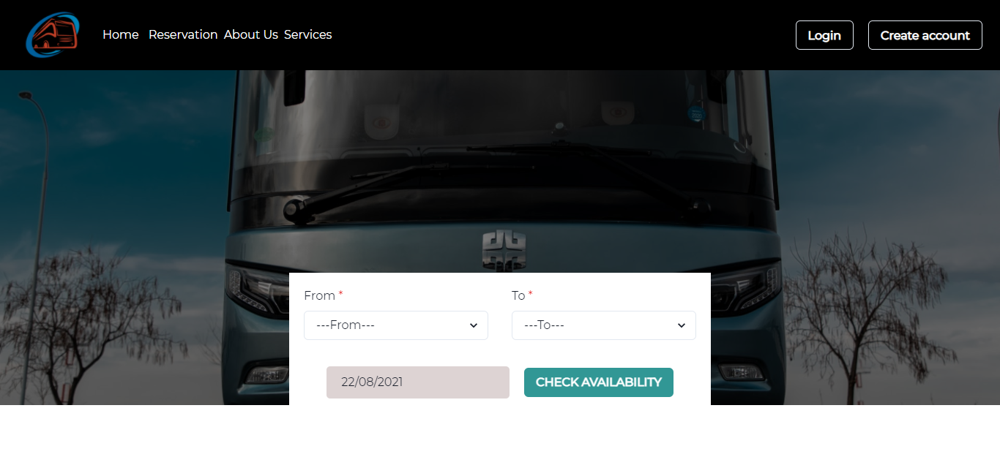

# Node Transportation

Node Transportation is a web application that I developed. It's a fully functional bus seat reservation web app. Users can book a bus ticket when they choose their travel destination and location.

### Bellow are the functionalities of the app:

<ul>
<li>Users can sign in and sign out (Authentication)</li>
<li>Users can search for available trip schedules based on their departure location, arrival location, and departure date</li>
<li>Users can book a ticket by selecting number of passengers (child or adult), and then choose their desired seat numbers and then book and pay for their ticket</li>
<li>
Users receives email containing their receipt of payment, and their travel details
</li>
</ul>
 

### <a href="https://bus-seat-reservation-app.netlify.app/">Live Demo</a>

<h2>Stacks and Technologies used in Developing the App</h2>

### Frontend

&nbsp;
&nbsp;
&nbsp;
&nbsp;
&nbsp;
&nbsp;
&nbsp;

### Backend

&nbsp;
&nbsp;
&nbsp;

 

## Available Scripts

### /backend directory

Before running the script in the /frontend make sure you run the script in the /backend first.
 
Note: Before you run the /backend script make sure you add these environment variables:
<ul>
<li>bus_jwtPrivateKey</li>
bus_jwtPrivateKey is the jwt key
<li>bus_email</li>
bus_email is the transporter email that nodemailer will use to send mail. I used gmail
<li>bus_emailPassword</li>
bus_emailPassword is your email password
<li>bus_db</li>
bus_db is your mongo connection string
</ul>

After adding the environment variables, cd into the /backend directory and run:

### node index.js

This will start a new local server for your app in port 5000

 

### /frontend directory

Cd into the /frontend directory and run the following scripts:

### `npm start`

Runs the app in the development mode.\
Open [http://localhost:3000](http://localhost:3000) to view it in the browser.

The page will reload if you make edits.\
You will also see any lint errors in the console.

### `npm test`

Launches the test runner in the interactive watch mode.\
See the section about [running tests](https://facebook.github.io/create-react-app/docs/running-tests) for more information.

### `npm run build`

Builds the app for production to the `build` folder.\
It correctly bundles React in production mode and optimizes the build for the best performance.

The build is minified and the filenames include the hashes.\
Your app is ready to be deployed!
